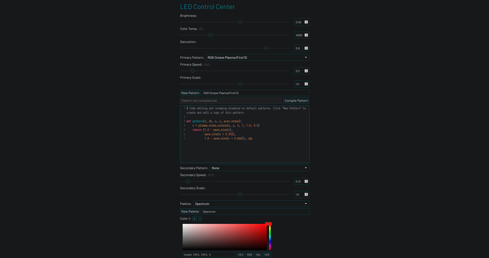

# LED Control



## Features
* Lightweight responsive web interface works on both desktop and mobile devices
* In-browser code editor with smart indentation, syntax highlighting, and syntax error detection makes creating animation patterns easy
* Animation patterns are defined as Python functions that work similarly to fragment shaders
* Builtin secondary patterns make it possible to quickly create more complex effects
* Works with cheap and readily available WS281x and SK6812 LED strips and strings
* Seamlessly supports HSV-to-RGBW and RGB-to-RGBW conversion for RGBW LED strips
* Capable of achieving up to 380 FPS on 60 LEDs and 160 FPS on 150 LEDs on a Raspberry Pi Zero (see note below)
* Web backend and animation code written in Python using the [Flask](https://github.com/pallets/flask) web framework for ease of development
* Color conversions, color correction, and final rendering operations are implemented in a C extension module for maximum performance

### Framerate Note
Complex shaders will run slower, but framerates should stay comfortably above 24FPS even with large numbers of LEDs. This should not be an issue unless you are trying to display very fast-moving animations on long LED strips. All of the framerate numbers here were obtained from testing on a Raspberry Pi Zero, and almost any other Pi will run animations faster. The framerate is limited to 60FPS by default to reduce CPU usage.

## Install
### Hardware Setup
1. Obtain a Raspberry Pi (any model), a WS2812B or SK6812B LED strip (SK6812 RGB/White LEDs are highly recommended), and a suitable 5V power supply.
2. Connect the LED strip to your Raspberry Pi:
    - Pi GND to LED GND
    - Pi GPIO18 to LED Data in
    - Power supply ground to LED GND
    - Power supply 5V to LED 5V

   See [this Adafruit guide](https://learn.adafruit.com/neopixels-on-raspberry-pi/raspberry-pi-wiring#using-external-power-source-without-level-shifting-3005993-11) for other ways to connect the LED strips or using a level shifter.


Know what you're doing with electricity. Addressable LEDs can draw a lot of current, especially in long strips. You should budget [at least 50mA for each LED at full brightness](https://www.pjrc.com/how-much-current-do-ws2812-neopixel-leds-really-use/), which means 7.5A for 150 LEDs (5 meters of 30 LED/m strip, 2.5m of 60LED/m strip, ~1m of 144LED/m strip...). In practice, your LED strips probably won't draw this much current, but it's good to have a power supply capable of handling it.

The flexible PCBs and connectors used in these LED strips are not really designed to handle these currents, and begin to heat up when passing as little as 2-3A. The voltage drop is significant (I measured a 0.6v drop across each power rail along the length of a 3m strip drawing about 3A), but it does not seem to impact color or brightness in individual strips under 5m long.

For long strips (~150 LEDs) at high brightness and/or total current draw over 5A, I would recommend powering each strip from both ends with adequately sized (18AWG) wires to mitigate any issues with voltage drop. Addressable LED strips usually come with seriously undersized power wires and barrel jacks or JST SM connectors rated for only 3A, and it would be a good idea to replace these appropriately in any case.

For installations with over 150 LEDs, don't expect to get good or safe results by daisy chaining strips together. See [this guide](https://learn.adafruit.com/1500-neopixel-led-curtain-with-raspberry-pi-fadecandy/power-topology) for good information on powering hundreds or thousands of LEDs.

For more information on which GPIO pins LED strips can be connected to, see [here](https://github.com/jgarff/rpi_ws281x).

### Software Setup
Python 3.7 or newer is required.

1. `sudo apt-get install scons swig`
2. `git clone --recurse-submodules https://github.com/jackw01/led-control.git`
3. `cd led-control`
4. `sudo python3 setup.py develop`
5. `sudo ledcontrol --led_count 150` (add `--led_pixel_order GRBW` if using RGBW LEDs)

### Command Line Configuration Arguments
Web server and LED hardware parameters must be specified as command line arguments when running ledcontrol.
```
usage: ledcontrol [-h] [--port PORT] [--host HOST]
                  [--led_count LED_COUNT] [--fps FPS]
                  [--led_pin LED_PIN]
                  [--led_data_rate LED_DATA_RATE]
                  [--led_dma_channel LED_DMA_CHANNEL]
                  [--led_pixel_order LED_PIXEL_ORDER]
                  [--led_color_correction LED_COLOR_CORRECTION]
                  [--led_brightness_limit LED_BRIGHTNESS_LIMIT]
                  [--save_interval SAVE_INTERVAL]
optional arguments:
  -h, --help            show this help message and exit
  --port PORT           Port to use for web interface. Default: 80
  --host HOST           Hostname to use for web interface. Default: 0.0.0.0
  --led_count LED_COUNT Number of LEDs.
  --fps FPS             Refresh rate limit for LEDs, in FPS. Default: 60
  --led_pin LED_PIN     Pin for LEDs (see https://github.com/jgarff/rpi_ws281x).
                        Default: 18
  --led_data_rate LED_DATA_RATE
                        Data rate for LEDs. Default: 800000 Hz
  --led_dma_channel LED_DMA_CHANNEL
                        DMA channel for LEDs. DO NOT USE CHANNEL 5 ON Pi 3 B.
                        Default: 10
  --led_pixel_order LED_PIXEL_ORDER
                        LED color channel order. Any combination of RGB with or
                        without a W at the end.
                        Default: GRB, try GRBW for SK6812 RGBW LEDs
  --led_color_correction LED_COLOR_CORRECTION
                        LED color correction in RGB hex form. Try #FFB0F0 for
                        5050 package RGB LEDs, #FFA8FF for 5050 RGBW LEDs, and
                        #FFE08C for through-hole package LEDs or light strings.
                        Default: #FFB0F0
  --led_brightness_limit LED_BRIGHTNESS_LIMIT
                        LED maximum brightness limit for the web UI. 0.0-1.0.
                        Default: 1.0
  --save_interval SAVE_INTERVAL
                        Interval for automatically saving settings in seconds.
                        Default: 60
```

## Pattern Editing
Animation patterns are defined as Python functions that work similarly to GLSL fragment shaders or DirectX pixel shaders. The LEDControl web interface allows editing and creation of patterns using a subset of Python.

Patterns are compiled using [RestrictedPython](https://github.com/zopefoundation/RestrictedPython) and run with a restricted set of builtin functions and global variables. This should prevent filesystem access and code execution, but the scripting system **should not be considered completely secure** and the web interface **should not be exposed to untrusted users**.

### Pattern Function Guide
Each animation frame, the pattern function is called once per LED/pixel with time, position, and previous state as inputs to determine the next color of that pixel.

```python
# cycle_hue_1d
def pattern(t, dt, x, y, prev_state):
    return (t + x, 1, 1), hsv
```

#### Arguments
##### `t`
Time in cycles (an arbitary unit that represents one animation cycle as a floating point number). Calculated by multiplying real time in seconds by animation speed in Hz (cycles/second).

##### `dt`
Delta time in cycles.

##### `x`, `y`
Normalized (0 to 1) value representing the position of the current LED in arbitrary units (after mapping LED indices to positions and scaling). Straight LED strips are mapped to the x axis only. One position unit represents the scale factor multiplied by the length of the axis. At a scale of less than 1, one position unit represents a fraction of the axis length and the animation is repeated to fill all the LEDs.

##### `prev_state`
Previous color state of the current LED as an HSV or RGB tuple. Initialized to `(0, 0, 0)` on the first animation frame.

#### Return Values
Pattern functions must return a color in tuple form and either `hsv` or `rgb` depending on the format of the color. All values are expected to be in the 0 to 1 range, except for hue. Hue values less than 0 or greater than 1 will wrap. RGB values will be clamped to the 0 to 1 range.

### Supported Python Globals
* Builtins: `None`, `False`, `True`, `abs`, `bool`, `callable`, `chr`, `complex`, `divmod`, `float`, `hash`, `hex`, `id`, `int`, `isinstance`, `issubclass`, `len`, `oct`, `ord`, `pow`, `range`, `repr`, `round`, `slice`, `str`, `tuple`, `zip`
* All functions and constants from the [`math` module](https://docs.python.org/3/library/math.html)
* All functions from the [`random` module](https://docs.python.org/3/library/random.html)

### Color Palette Access

##### `palette(t)`
Returns the color from the current palette (stored in a lookup table) corresponding to a value `t` between 0 and 1. Values of `t` less than 0 or greater than 1 will wrap.

##### `palette_length()`
Returns the number of colors used to generate the current palette.

### Wave Functions
All waveforms have a period of 1 time unit, a range from 0 to 1, and a peak (`f(t)=1`) at `t=0`. These wave functions are implemented in C which gives a suprisingly significant performance improvement over Python's builtins.

##### `wave_sine(t)`
Returns the instantaneous value of a 1Hz sine wave at time `t`.

##### `wave_cubic(t)`
Returns the instantaneous value of a 1Hz cubic approximated sine wave (triangle wave with cubic easing) at time `t`. Appears to spend more time near 0 and 1 than a sine wave.

##### `wave_triangle(t)`
Returns the instantaneous value of a 1Hz triangle wave at time `t`.

##### `wave_pulse(t, duty_cycle)`
Returns the instantaneous value of a 1Hz pulse wave of the specified duty cycle (range 0 to 1) at time `t`.

##### `plasma_sines_octave(x, y, t, octaves, temporal_freq_persistence, amplitude_persistence)`
Custom optimized "plasma" implementation that returns a sum of several octaves of sinusoid-based waveforms creating a non-random noise effect. This creates more detailed and better looking plasma effects than simpler implementations. For each successive octave, the spatial frequency of the wave is multiplied by 2, the temporal frequency (how fast the wave changes with time) is multiplied by `temporal_freq_persistence`, and the amplitude is multiplied by `amplitude_persistence`. Returns a value from 0 to 1. `octaves` must be an integer. See the usage notes below.

##### `perlin_noise_3d(x, y, z)`
Standard 3D perlin noise. Use time as one of the arguments to make the noise vary with time. Returns a value from 0 to 1.

##### `plasma_sines(x, y, t, coeff_x, coeff_y, coeff_x_y, coeff_mag_xy)`
Basic optimized function for creating RGB plasma animations (see [https://www.bidouille.org/prog/plasma](https://www.bidouille.org/prog/plasma)). Returns `sin((x + t) * coeff_x) + sin((y + t) * coeff_y) + sin((x + y + t) * coeff_x_y) + sin((sqrt(x * x + y * y) + t) * coeff_mag_xy)`. Returns a value from 0 to 1. Not recommended unless you want it, `plasma_sines_octave` generally looks better.

### Additional Utility Functions
##### `clamp(x, min, max)`
Returns `min` if `x < min` and `max` if `x > max`, otherwise returns `x`.

##### `fract(x)`
Returns the floating point component of `x` (`x - floor(x)`).

##### `impulse_exp(t)`
Asymmetrical exponential "impulse" wave function. Peaks at `t=1`.

##### `blackbody_to_rgb(kelvin)`
Returns a normalized RGB tuple for a color temperature in Kelvin.

##### `blackbody_correction_rgb(rgb, kelvin)`
Tints an RGB color (normalized RGB tuple) to a color temperature in Kelvin. Returns a normalized RGB tuple.

### Using Plasma Utility Functions
`plasma_sines` and `plasma_sines_octave` both return the instantaneous value of a 2D periodic function at time `t` and position (`x`, `y`). The typical way of converting this value to a color is to assign the RGB values to expressions of the form `a * wave_sine(b * x + c) + d`, where `wave_sine` is a function that returns a sinusoid waveform with range 0 to 1. This is done in the code for several built in patterns.

Below is GLSL code for testing and experimenting with these plasma functions in 2D. This code can be easily run on [Shadertoy](https://www.shadertoy.com/new).

##### `plasma_sines`
```GLSL
float wave_sine(float t) {
  return cos(6.283 * t) / 2.0 + 0.5;
}

float plasma_sines(float x, float y, float t,
                   float coeff_x, float coeff_y,
                   float coeff_x_y, float coeff_dist_xy) {
  float v = 0.0;
  v += sin((x + t) * coeff_x);
  v += sin((y + t) * coeff_y);
  v += sin((x + y + t) * coeff_x_y);
  v += sin((sqrt(x * x + y * y) + t) * coeff_dist_xy);
  return v;
}

void mainImage(out vec4 fragColor, in vec2 fragCoord) {
  // Normalized pixel coordinates (from 0 to 1)
  vec2 uv = fragCoord / iResolution.xy;

  float v = plasma_sines(uv.x, uv.y, iTime, 1.0, 0.5, 0.5, 1.0);

  float r = 0.8 - wave_sine(v);
  float g = wave_sine(v + 0.333) - 0.2;
  float b = 0.8 - wave_sine(v + 0.666);

  fragColor = vec4(r, g, b, 1.0);
}
```

##### `plasma_sines_octave`
```GLSL
float wave_sine(float t) {
  return cos(6.283 * t) / 2.0 + 0.5;
}

float plasma_sines_octave(float x, float y, float t,
                          int octaves,
                          float temporal_freq_persistence,
                          float amplitude_persistence) {
  float vx = x;
  float vy = y;
  float spatial_freq = 1.0;
  float temporal_freq = 1.0;
  float amplitude = 1.0;
  for (int i = 0; i < octaves; i++) {
    float vx1 = vx;
    vx += cos(vy * spatial_freq + t * temporal_freq) * amplitude;
    vy += sin(vx1 * spatial_freq + t * temporal_freq) * amplitude;
    spatial_freq *= 2.0;
    temporal_freq *= temporal_freq_persistence;
    amplitude *= amplitude_persistence;
  }
  return vx / 2.0;
}

void mainImage(out vec4 fragColor, in vec2 fragCoord) {
  // Normalized pixel coordinates (from 0 to 1)
  vec2 uv = fragCoord / iResolution.xy;

  float v = plasma_sines_octave(uv.x, uv.y, iTime, 8, 1.5, 0.5);

  float r = 0.8 - wave_sine(v);
  float g = wave_sine(v + 0.333) - 0.2;
  float b = 0.8 - wave_sine(v + 0.666);

  fragColor = vec4(r, g, b, 1.0);
}
```

## Development
To build the C extension module:
```
swig -python ./ledcontrol/driver/ledcontrol_rpi_ws281x_driver.i && sudo python3 setup.py develop
```

## License
MIT
