## Built-In Animation Patterns

In the images below, the y-axis represents the colors of a linear array of LEDs and the x-axis represents time.

## Static Color

## Static Gradient 1D

## Static Gradient Mirrored 1D
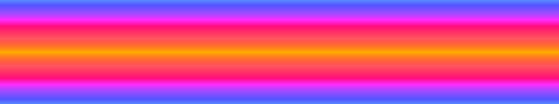

## Hue Cycle 1D

## Hue Cycle Quantized 1D
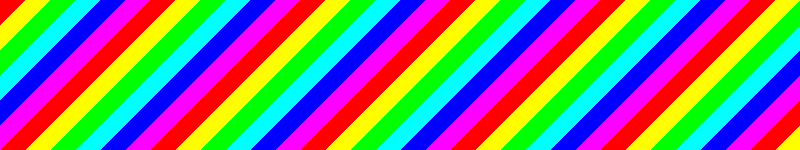

## Hue Scan 1D

## Hue Bounce 1D

## Hue Waves 1D

## Hue Ripples 1D

## Palette Cycle 1D
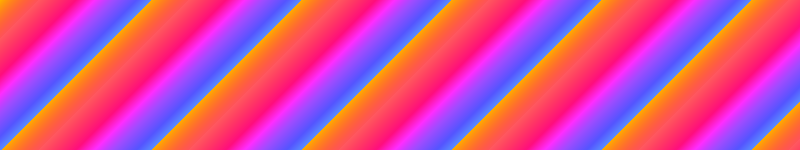

## Palette Cycle Mirrored 1D

## Palette Cycle Quantized 1D

## Palette Cycle Random 1D
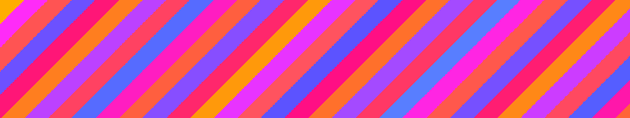

## Palette Scan Mirrored 1D
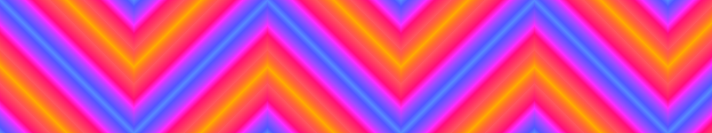

## Palette Bounce Mirrored 1D
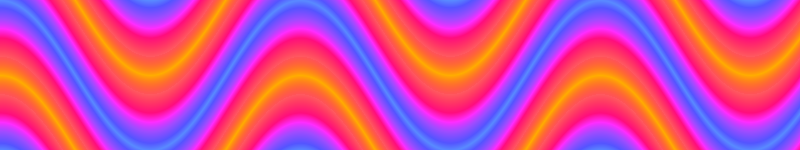

## Palette Waves 1D

## Palette Ripples 1D

## Palette Ripples (Fast Cycle) 1D
-1D.png)
-1D.gif)

## Palette Plasma 2D

## Palette Fractal Plasma 2D
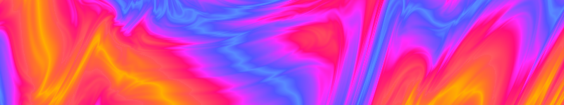

## Palette Twinkle 1D

## Palette Perlin Noise 2D
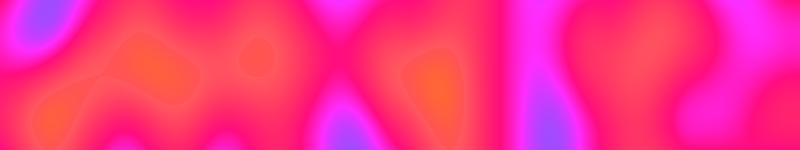

## RGB Sines 1D
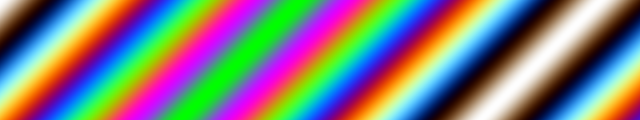

## RGB Cubics 1D
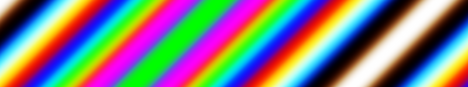

## RGB Ripples 1 1D

## RGB Plasma (Spectrum Sines) 2D
-2D.png)
-2D.gif)

## RGB Plasma (Fire Sines) 2D
-2D.png)
-2D.gif)

## RGB Fractal Plasma (Fire Sines) 2D
-2D.png)
-2D.gif)

## Blackbody Cycle 1D
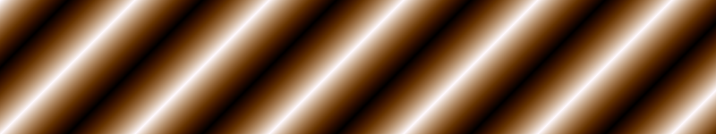

